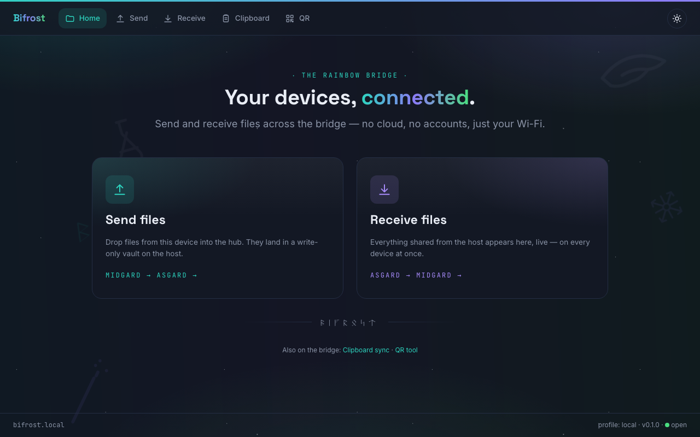
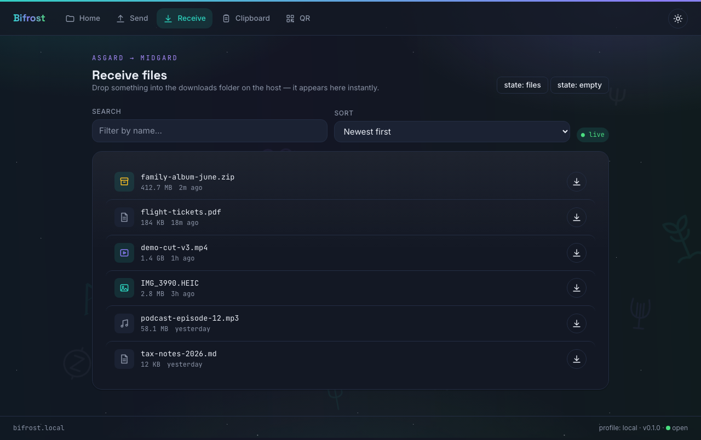
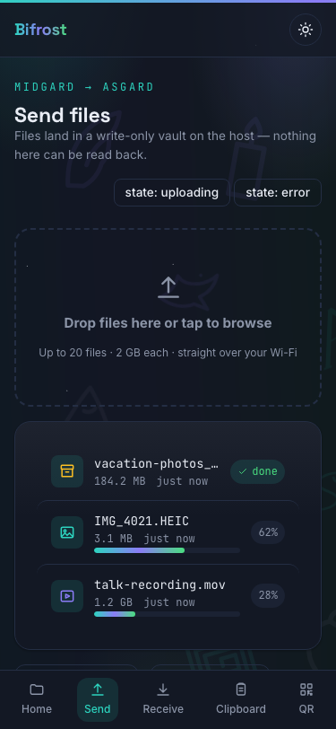
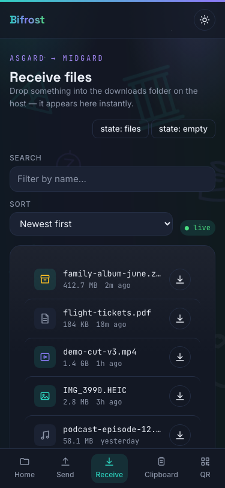
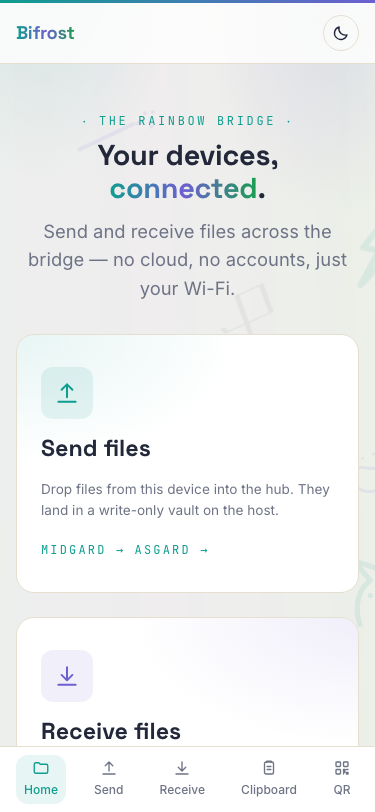

<div align="center">

# 🌈 Bifrost

**A LAN-only file transfer & sync hub. Your devices, connected by the rainbow bridge.**


<!-- TODO: add demo video when the features land (PLAN-02+) -->




<p>
  
  
  
</p>

</div>

---

## What is Bifrost?

Bifrost turns one Mac on your local network into a private file & sync hub for every device in the house — iPhone, Android, iPad, any laptop. No cloud, no public internet, no accounts. Advertised over mDNS at `http://bifrost.local`.

**Features**

- 📤 Multi-file upload (streamed, 2 GB configurable limit) into a write-only folder
- 📥 Live download page — drop a file into a folder in Finder, it appears on every device instantly (SSE)
- 👁 In-browser previews — images, PDF, video (seekable), markdown
- 📋 Muninn — clipboard/text sync across devices
- 🔳 Sigil — QR generator utility (+ scan-to-join QR for the server URL)
- 🎨 Dynamic themes (Aurora, Daybreak, Ghibli Dusk, Olympus built in), addable via JSON
- 🛡 Heimdall — hidden admin panel (secret gesture/shortcut + PIN)
- 📜 Wardens — device presence dashboard with character-name aliases; upload history & activity log in Heimdall
- 🔁 Restart-safe: all state survives server stop/start

## Quick start

> Prerequisites: **Node.js ≥ 20**, **npm ≥ 10**, macOS (primary host target).

```bash
# 1. install dependencies
npm install

# 2. create local env from template
cp .env.example .env

# 3. create runtime folders (storage/{uploads,downloads,tmp,data,logs})
npm run setup

# 4. run in dev (server + client, hot reload)
npm run dev
```

Then open `http://bifrost.local:<PORT>` from any device on the same Wi-Fi — or scan the QR printed in the terminal.

## Scripts

| Command | What it does |
|---|---|
| `npm run setup` | Creates storage folders, verifies `.env`, runs DB migrations |
| `npm run dev` | Dev mode with hot reload (server + client) |
| `npm run build` | Production build (client + server) |
| `npm start` | Run production build |
| `npm run logs` | Pretty-tail the JSON log file |
| `npm run backup` | Zip `storage/` to a backup location |
| `npm test` / `npm run lint` / `npm run typecheck` | Quality gates (also run in CI) |

## Project docs

Architecture, rules, plans and progress live in [`.agent/`](.agent/). Start with [`.agent/plans/README.md`](.agent/plans/README.md).

## License

MIT
