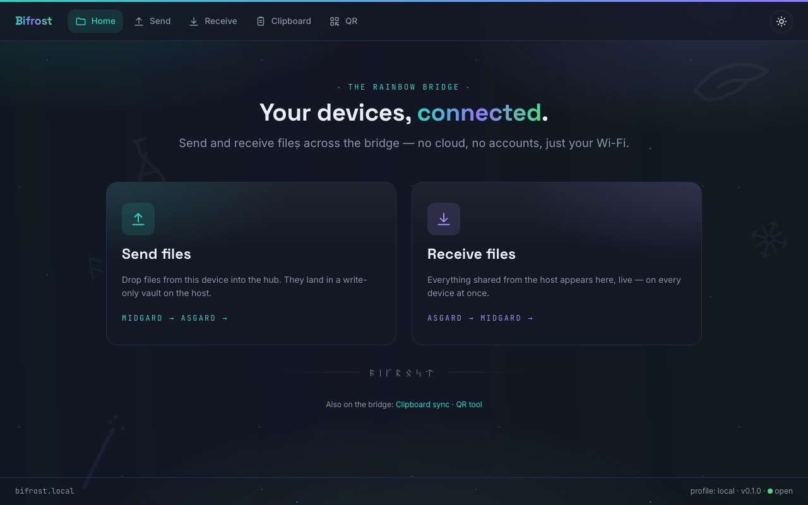
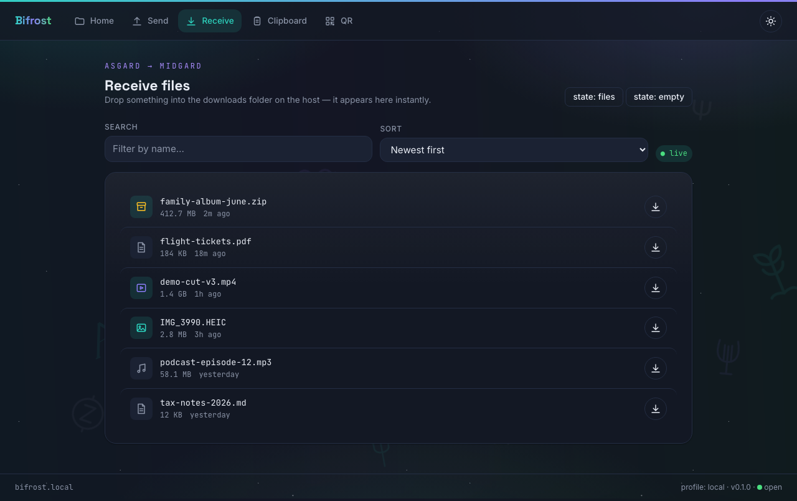
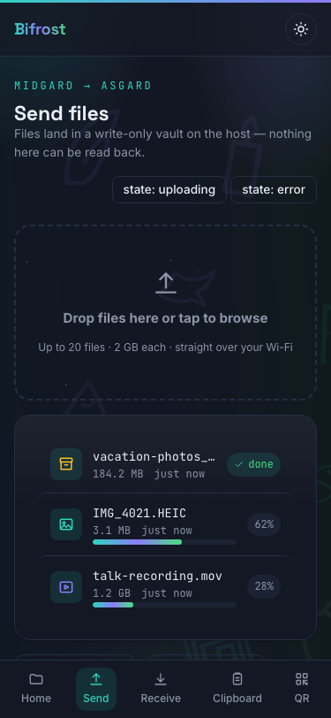
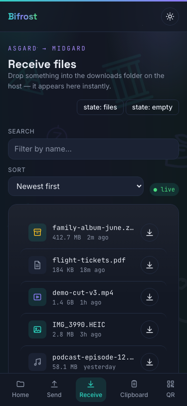
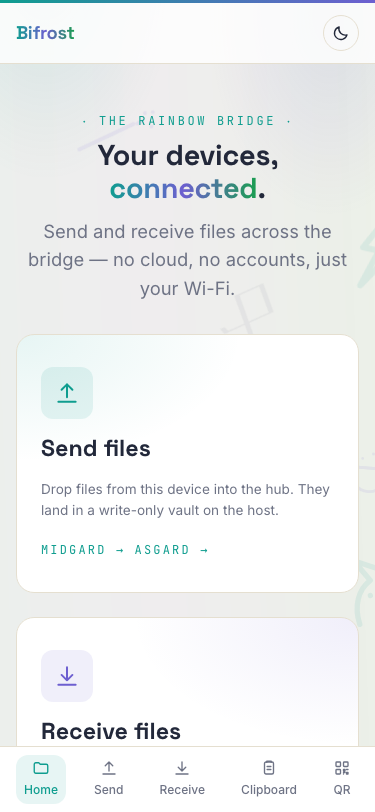

<div align="center">

# 🌈 Bifrost

**A private LAN hub — file transfer & sync, a workbench of dev tools, and a drawer of network utilities.**


<!-- TODO: add demo video when the features land (PLAN-02+) -->




<p>
  
  
  
</p>

</div>

---

## What is Bifrost?

Bifrost turns one machine on your local network — a Mac natively, or a Linux box (Raspberry Pi included) via Docker — into a private hub for every other device in the house: iPhone, Android, iPad, any laptop. Files move between devices, structured documents get their own workbench, and a handful of everyday utilities live one tap away. No cloud, no public internet, no accounts. Advertised over mDNS at `http://bifrost.local`.

The app is organized into three category tabs, plus a few things that work everywhere.

### 🌈 Midgard — transfer & sharing

- 📤 **Send** — multi-file upload (streamed, 2 GB configurable limit) into a staging area you can preview, rename or delete before publishing to Downloads — or send straight into a named folder — and every device gets a banner
- 📥 **Receive** — drop a file into a folder in Finder and it appears on every device instantly (SSE); folders are browsable one level deep and download as a `.zip`
- 👁 In-browser previews for images, PDF, video (seekable), and Markdown
- 📋 **Hermes** — clipboard/text sync across devices
- 🔖 **Accio** — read-later shelf with tags and best-effort page-title lookup
- 🎞 **Saga** — present a deck fullscreen: drop a `.md` file (`---` splits the slides, `<!-- notes: … -->` feeds the presenter panel) or a `.pdf` (one page per slide), or open a saved Edda; keyboard navigation, resizable text that carries into fullscreen, and a shortcuts overlay — nothing is uploaded or stored
- A scan-to-join QR for the server URL, right on the home page

### 🪄 Ollivanders — dev tools ("the tool chooses the maker")

- 🧿 **Runestone** — JSON viewer/editor with in-editor find and tree collapse-all
- ⚖️ **Variant** — structural JSON diff (key order & formatting are noise) with a raw-text fallback and cross-pane reveal; export as an RFC 6902 JSON Patch or a git-shaped unified `.patch`
- 📖 **Edda** — Markdown editor with live preview (Mermaid diagrams render inline); share as a rendered page, raw `text/markdown`, or a printable HTML/PDF export
- 🃏 **Loki** — JavaScript workbench: transforms, a regex tester, and a sandboxed Web-Worker runner
- 🌳 **Groot** — YAML workspace: folding, comment-preserving formatting, a tree view, YAML ⇄ JSON, and an advisory rail for the traps YAML hides in plain sight (`country: no` is a string here and `false` to a YAML 1.1 reader)
- 🌐 **Atlas** — XML workspace: format, minify, fold; an Apple property list also opens as an editable, Xcode-shaped table
- 🗜 **Brotli** — compress text or a file, or decompress a `.br`, with a live gzip comparison and a one-click hand-off into whichever editor above the result fits
- 🗃 **Pensieve** — one saved-document library across Runestone, Edda, Groot and Atlas; every saved doc doubles as a public data URL
- 💡 A header bulb opens a **guide panel** — a per-page format reference (JSON, Markdown, XML, YAML, JavaScript, Brotli) with copyable code examples

### 🎪 Diagon Alley — utilities

- 🔳 **Sigil** — QR generator ("Make a QR")
- 🧹 **Nimbus** — LAN speed test: download/upload/latency between a device and the bridge, with per-device history
- 🚪 **Portkey** — LAN go-links: `bifrost.local/go/<slug>` redirects, with a QR per link
- Plus 12 more pure-client utilities that expand in place: Base64, UUID, Unix time, URL encode/decode, ASCII/Hex/Binary, JWT decode, colour tools (Iris), a CIDR calculator, a text-case converter, a password generator, a cron expression explainer, and SHA-256 hashing (host-only — needs a secure context browsers only grant on `localhost`)

### Everywhere

- 🎨 Themes (Aurora, Daybreak, Ghibli Dusk, Olympus, Gryffindor, Slytherin, Tokyo built in), bundled with the client: add one as a JSON file and rebuild
- 🌌 **Nótt** — idle screensaver overlay (particle constellations), desktop-only and tunable from Heimdall
- 🛡 **Heimdall** — hidden admin panel (secret gesture/shortcut + PIN)
- 📜 **Wardens** — device presence dashboard with character-name aliases; upload history & activity log in Heimdall
- 🔁 Restart-safe: all state survives server stop/start

Each stateful page keeps its own URL; the Diagon Alley utilities open inline at `/diagon-alley/<tool>`.

## Quick start

> Prerequisites: **Node.js ≥ 20**, **npm ≥ 10**, macOS (primary host target).

```bash
# 1. install dependencies
npm install

# 2. create local env from template
cp .env.example .env

# 3. create runtime folders (storage/{uploads,downloads,tmp,data,logs})
npm run setup

# 4. run in dev (API + client, hot reload)
npm run dev
```

Then open `http://bifrost.local:<PORT>` from any device on the same Wi-Fi — or scan the QR printed in the terminal.

## Run it as a service (macOS)

For an always-on hub that survives crashes and reboots, run it natively (this is
the production mode — mDNS/`bifrost.local` works, unlike Docker on macOS). One
command builds and starts it:

```bash
sh scripts/start-pm2.sh        # via PM2 (rich logs/monitoring; installs pm2)
# — or —
sh scripts/start-launchd.sh    # via launchd (zero extra deps, native)
```

Pick one, not both. Details + how to choose: [`docs/pm2.md`](docs/pm2.md) ·
[`docs/launchd.md`](docs/launchd.md).

Bifrost runs as **two processes** (PLAN-36): the **web host** on `PORT` (4646),
which serves the page, answers for `bifrost.local` and forwards API calls, and
the **API server** behind it on `127.0.0.1:API_PORT` (default 4647, never on the
LAN). The address is the same as ever. Restarting the API alone leaves the page
up, showing "The Bifröst is closed" until it is back. `BIFROST_RUN` in `.env`
picks what runs: `full` (both, the default), `api` (the API alone, for the CLI
on this Mac: `bifrost --host 127.0.0.1:4647`) or `web` (the standalone tools
site alone).

The API is versioned in its path (PLAN-37): every call is `/api/v1/…`, and a
saved document's raw content is at `/<kind>/api/v1/<slug>`, which is what the
Pensieve's "API" link and "Copy curl" give you:

```bash
curl -sS http://bifrost.local:4646/api/v1/health
curl -sS http://bifrost.local:4646/edda/api/v1/<slug>
```

Paths from before versioning (`/api/health`, `/edda/api/<slug>`) still answer,
identically, as v1, with a `Deprecation` header pointing at the new path. Links
saved elsewhere and older scripts and CLIs keep working.

Every operation is browsable, and can be tried, in Swagger UI at
`http://127.0.0.1:4647/docs` on the server machine (not `bifrost.local`: the API
listens on loopback). See [`docs/api.md`](docs/api.md).

### Upgrading from a version before PLAN-36

Re-run the same script you installed with. `start-pm2.sh` deletes the old
`bifrost` app and `start-launchd.sh` the old `local.bifrost` plist **before**
starting the two new processes, so nothing old holds the API's port or
advertises a second `bifrost.local`. On Linux, `docker compose up -d --build
--remove-orphans`. If the web host is ever missing after an upgrade, the API
logs an error saying so ten seconds after it starts.

**Optional Grafana view of the logs** (Docker containers; works alongside the
native run — Alloy tails `storage/logs/`). In a second terminal:

```bash
sh scripts/observability.sh    # http://localhost:3000  (admin / bifrost)
```

See [`docs/observability.md`](docs/observability.md). Back up all state
(`storage/`) any time with `npm run backup`, or schedule it
(macOS): set `BACKUP_CLOUD` (dropbox / icloud / onedrive / gdrive / path) in
`.env` and run `npm run backup:install` — a launchd agent checks daily and
backs up every `BACKUP_INTERVAL_DAYS` into the cloud folder, only while the
server is running. `npm run backup:status` shows the schedule, last run, and
next due date; `backup:stop` / `backup:start` pause and resume it.

## CLI

`bifrost` is a command-line client for a running hub — push and pull files, read
and write the shared clipboard, fetch saved documents, resolve go-links, check
server and device state, run a speed test. It is a third npm workspace
(`cli/`) that consumes the existing API and adds no server routes of its own.

Install it from the latest release's tarball:

<!-- CLI_INSTALL_START -->

```bash
npm install -g https://github.com/0xSiddhant/bifrost/releases/download/v1.4.0/bifrost-cli-1.4.0.tgz
```

<!-- CLI_INSTALL_END -->

```bash
bifrost push ~/Desktop/notes.pdf     # send a file to the bridge
bifrost pull                         # list what Downloads is offering
bifrost clip | pbcopy                # read the shared clipboard
bifrost doctor                       # check config, host, server, CLI version
```

Every command, the config file, the `--host`/discovery story, and how to run it
straight from a checkout without installing: [`cli/README.md`](cli/README.md).
On the host machine `npm run build` and `npm run start` re-install the global
`bifrost` from what is checked out, so it never drifts from the server it talks
to.

## Scripts

| Command                                                        | What it does                                                                                                                                                                         |
| -------------------------------------------------------------- | ------------------------------------------------------------------------------------------------------------------------------------------------------------------------------------ |
| `npm run setup`                                                | Creates storage folders, verifies `.env`, runs DB migrations                                                                                                                         |
| `npm run dev`                                                  | Dev mode with hot reload: the API, Vite on `PORT` (forwarding to the API), and the mDNS name                                                                                         |
| `npm run build`                                                | Production build (both clients, the API, the web host), then re-installs the global `bifrost` CLI                                                                                    |
| `npm run build:standalone`                                     | The standalone site into `client/dist-standalone/`; fails if the bundle can reach a server (PLAN-35)                                                                                 |
| `npm run dev:standalone` · `npm run preview:standalone`        | Run the standalone site locally: Vite dev with hot reload, or build then serve the real output ([`docs/standalone.md`](docs/standalone.md))                                          |
| `npm start`                                                    | Re-installs the global `bifrost` CLI, then runs the production build: the processes `BIFROST_RUN` picks, as one (Ctrl-C stops the web host, then the API)                             |
| `npm run logs`                                                 | Pretty-tail the JSON log file                                                                                                                                                        |
| `npm run db:studio` (or `cd server && npx drizzle-kit studio`) | Opens [Drizzle Studio](https://local.drizzle.studio) to browse/edit the SQLite data                                                                                                  |
| `npm run backup`                                               | Archive `storage/` to `BACKUP_DIR` (online-safe; `-- --include-env` to add `.env`)                                                                                                    |
| `npm run backup:install` / `backup:uninstall`                  | Install/remove the scheduled-backup launchd agent (macOS; settings in `.env`)                                                                                                        |
| `npm run backup:status`                                        | Schedule, agent state, last run/success/failure, stored backups, next due date                                                                                                       |
| `npm run backup:stop` / `backup:start`                         | Pause scheduled backups (stays off across logins) / resume them                                                                                                                      |
| `npm run backup:run [-- --force]`                              | Run the scheduled job now; `--force` skips the "not due yet" check                                                                                                                   |
| `npm run restore -- <path>`                                    | Restore a backup: a `.zip`, one backup's folder (exactly that one), or a folder of backups (the newest). Checks `meta.json`'s checksum first; refuses a live server unless `--force` |
| `npm run test:resilience`                                      | Restart-resilience suite (50 restarts + SIGKILL, integrity-checked; on-demand)                                                                                                       |
| `npm run test:all`                                             | **Every test, one command:** `npm audit` → lint → typecheck → `npm test` → build → `test:e2e` (the same gate CI and the `verify` skill run). See [Testing](#testing)                               |
| `npm test` / `npm run lint` / `npm run typecheck`              | Quality gates (also run in CI)                                                                                                                                                       |
| `npm run test:e2e`                                             | End-to-end: every page in real browsers, the installed CLI, and the black-box API suite, against the build (needs `npm run build`)                                                   |
| `npm run test:load [-- --profile <name>]`                      | On-demand load, stress, spike, soak and fan-out runs against the built server ([`docs/performance.md`](docs/performance.md))                                                         |

Convenience shell scripts (macOS service run): `scripts/start-pm2.sh`,
`scripts/start-launchd.sh`, `scripts/observability.sh`.

## Testing

**One command runs everything:** `npm run test:all` (`npm audit`, lint, typecheck, unit + integration tests, build, end-to-end). The first time, install Playwright's browsers once: `cd e2e && npx playwright install chromium webkit`.

Tests live in two kinds of place, on purpose. Unit and integration tests sit **beside the code they test**, in `server/`, `client/` and `cli/`. End-to-end tests live in **`e2e/`** and only ever drive the built app from outside. [`docs/testing.md`](docs/testing.md) is the map: every kind of test, where it lives, how to run and replay one, and what each one protects. Load, stress and soak runs are on demand, never in CI: `npm run test:load` ([`docs/performance.md`](docs/performance.md)).

## Project docs

Architecture, rules, plans and progress live in [`.agents/`](.agents/). Start with [`.agents/plans/README.md`](.agents/plans/README.md).

Operating & deploying:

- [`docs/pm2.md`](docs/pm2.md) · [`docs/launchd.md`](docs/launchd.md) — run as a service on macOS
- [`docs/observability.md`](docs/observability.md) — optional Grafana + Loki + Alloy + Prometheus + Tempo stack
- [`docs/docker-linux.md`](docs/docker-linux.md) — Docker on a Linux host: one image per process, compose files you can combine (`docker compose up` is the hub, `--profile observability` adds Grafana)
- [`docs/docker-mac.md`](docs/docker-mac.md) — on the Mac, the web host in Docker beside the native API, with a native advertiser for `bifrost.local`
- [`docs/standalone.md`](docs/standalone.md) — the standalone site: the browser-only tools, run locally (`npm run dev:standalone` / `preview:standalone`) or as a static container behind your reverse proxy
- [`docs/releasing.md`](docs/releasing.md) — automated releases (develop → main)
- [`docs/cloud-profile.md`](docs/cloud-profile.md) — checklist for a future internet deployment
- [`docs/offline-mode.md`](docs/offline-mode.md) — how pure-client pages keep working after the LAN drops
- [`docs/THEME-SPEC.md`](docs/THEME-SPEC.md) · [`docs/DESIGN.md`](docs/DESIGN.md) — themes & design system
- [`cli/README.md`](cli/README.md) — the `bifrost` command-line client
- [`docs/api.md`](docs/api.md) — the API docs (Swagger UI) at `http://127.0.0.1:4647/docs` on the server machine, and how to reach them from another one
- [`docs/testing.md`](docs/testing.md) — every kind of test, where it lives and how to run it
- [`docs/performance.md`](docs/performance.md) — the on-demand load harness: profiles, numbers, comparing two builds

## License

MIT
