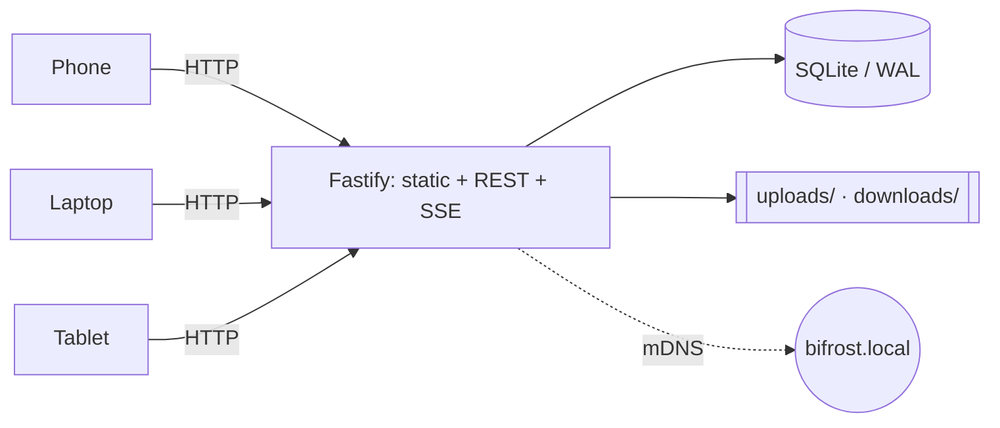

# Local-First on a Living-Room LAN

### Building a file hub that never phones home

**Siddhant** · a tech meetup, somewhere with decent coffee

<!-- notes: Wait for the room to settle. Thirty seconds of silence here is fine — people are still finding seats. Open by asking for a show of hands: "who has AirDropped something to a non-Apple device this month?" The laugh is the hook. -->

---

## The problem, in one sentence

You have a laptop, a phone, a tablet, and a NAS in a cupboard.

Moving a 400 MB video between any two of them involves:

- a cloud account neither device needed,
- an upload over a 40 Mbps link,
- a download back over the same link,
- and a file that now lives on someone else's computer, forever.

**The two devices are four metres apart.**

<!-- notes: Land on the last line. Pause. This is the whole talk in one image — the bytes travelled 12,000 km to move 4 metres. Don't rush it. -->

---

## The constraint that shaped everything

> One Node process. One port. No cloud, no accounts, no reverse proxy.
> If the internet is down, everything still works.

That is not minimalism for its own sake. It is a **testable property**:

```bash
# The actual acceptance test
sudo ifconfig en0 down
open http://bifrost.local:4646   # still works
```

<!-- notes: Someone always asks "why not just use Syncthing / Snapdrop / a NAS share?" Good question — answer it now rather than in Q&A. Short version: those are each one of the things this does, and the interesting part was making them one app with one boundary rule. -->

---

## Shape of the thing



One process serves the SPA, the API, and the event stream. The browser gets
one origin, so there is no CORS story and nothing to orchestrate.

<!-- notes: If the diagram is too small at the back, this is the slide to bump the text size on — plus, plus, plus. Nobody minds. -->

---

## Rule 1 — vertical slices

Code is organised by feature, not by layer.

```text
server/src/modules/file-transfer/
├── module.ts        # composition: wires deps, registers routes
├── routes.ts        # HTTP concerns only
├── usecases/        # business rules, no fs and no SQL
├── repo.ts          # the interface the usecases depend on
└── *.int.test.ts    # driven against a real server
```

There is no `controllers/`, no `services/`, no `models/`. A feature is a
folder, and deleting the folder deletes the feature.

<!-- notes: The "deleting the folder deletes the feature" line is the one people write down. Give it a beat. -->

---

## Rule 2 — modules never import each other

Only `core/`. Cross-feature communication goes through an event bus.

```ts
// in file-transfer, after a successful publish
bus.emit('file.published', { name, folder, sizeBytes });

// in audit-log — which file-transfer has never heard of
bus.on('file.published', (meta) => repo.record('publish', meta));
```

And it is enforced, not encouraged:

```jsonc
// eslint-plugin-boundaries — a violating import fails the build
{ "from": "modules", "disallow": ["modules"] }
```

<!-- notes: This is the slide that earns the talk. Emphasise ENFORCED. Every codebase has an architecture diagram; the question is whether anything stops you violating it at 2am. A lint rule does. A wiki page does not. -->

---

## Rule 3 — a manifest decides what loads

```ts
const MANIFEST: Record<DeployProfile, FeatureModule[]> = {
  local: [fileTransfer, previews, clipboard, nimbus, portkey, /* …everything */],
  cloud: [health, themes, runestone, edda, /* internet-safe only */],
};
```

The server publishes what it loaded at `GET /api/capabilities`.
The **client renders its navigation from that response** — one build, two
deployments, and a feature that isn't loaded simply has no button.

<!-- notes: Worth saying out loud: this is why there is no `if (isCloud)` anywhere in the frontend. The server tells the truth once and the UI is a function of it. -->

---

## The measurement that changed the design

I assumed `fetch` streamed a file upload. I wrote the plan around that.

Then I measured it — out of process, on the live set, for a 400 MB file:

| Approach | Held in memory |
| --- | --- |
| `fetch` + `FormData` | **~412 MB** |
| `fetch`, `duplex: 'half'` stream body | **~402 MB** |
| `node:http`, multipart piped in | **~23 MB** |

<!-- notes: Be honest here — the first measurement was WRONG. I had the sink in the same process, so RSS made everything look like buffering. Re-running it out of process is what produced the table. Say that: the room trusts numbers more when you admit how you nearly got them wrong. -->

---

## What that cost, and what it bought

**Cost:** one command's upload path uses `node:http` instead of `fetch`,
with a hand-rolled multipart envelope. About sixty lines.

**Bought:** pushing a 4 GB file from a laptop with 8 GB of RAM does not
page. The guarantee the server's upload path was built to make is now
true on the client side too.

> A spike is worth it when the answer changes what you build.
> Two of the three I ran came back the opposite way to the plan.

<!-- notes: If short on time, this is the first slide to cut. The table before it carries the point on its own. -->

---

## Live updates without WebSockets

Drop a file into `downloads/` in Finder and it appears on every device.

```ts
chokidar.watch(downloadsDir, { depth: 1, awaitWriteFinish: true })
  .on('add', (path) => {
    bus.emit('download.added', describe(path));   // → SSE → every browser
  });
```

Server-sent events, not WebSockets, on purpose:

- notifications are **one-directional** — the browser has nothing to say back
- the browser reconnects on its own, with no library and no heartbeat code
- it is plain HTTP, so it survives every proxy anyone will put in front of it

<!-- notes: `awaitWriteFinish` is the unglamorous hero. Without it, a 2 GB copy fires `add` on the first byte and every device shows a broken thumbnail. Mention it — this is the kind of detail people come to meetups for. -->

---

## Restart safety is a feature, not a hope

The host is somebody's laptop. It sleeps, it reboots, it gets closed
mid-copy. So the kill test is part of the suite, not part of the README:

```ts
it('survives SIGKILL mid-write with no corruption', async () => {
  const child = await startServer();
  const upload = pushLargeFile(child);          // deliberately not awaited
  await delay(300);
  child.kill('SIGKILL');                        // no cleanup, no warning
  await expect(upload).rejects.toThrow();

  const restarted = await startServer();
  expect(pragma(restarted.db, 'integrity_check')).toBe('ok');
  expect(listUploads()).not.toContain('half-written.mp4');
});
```

Uploads stream to a temp file and land with `rename()`, which is atomic.
A crash leaves rubbish in `tmp/`, never a half-file in `uploads/`.

<!-- notes: Ask the room: "who has a test that kills their own process?" Usually two or three hands. That is the point — restart safety is claimed far more often than it is tested. -->

---

## The bug I want you to remember

The slideshow you are looking at had a size control. Pressing **+** made
the text bigger — and pushed the controls off the bottom of the page.

The page grew. The footer went with it.

**The one control you reach for while presenting walked away exactly
when you used it.**

The fix was three lines of CSS: a fixed frame, and let the deck scroll
inside it. The lesson was not CSS.

<!-- notes: This is the emotional centre of the talk. Every feature works in isolation; the bug only exists where two of them meet. Nobody would have caught this from a unit test, and no unit test did — a screenshot did. -->

---

## So: screenshots in the loop

Tests told me the feature worked. They were right, and it was unusable.

| Caught by | Bugs |
| --- | --- |
| Unit + integration tests | logic, parsing, error paths, exit codes |
| Actually looking at it | unreadable contrast, collapsed code blocks, a footer that ran away |

Every visible change now ends with a real browser, a real screenshot, and
me reading it before claiming it works.

<!-- notes: Don't moralise. State it flatly and move on — the previous slide already made them feel it. -->

---

## What I would do differently

1. **Measure before planning, not after.** Two spikes came back the
   opposite way to the design that depended on them.
2. **Write the acceptance criteria as questions, not assertions.**
   "Shows no panel when empty" was implemented exactly, and was the bug.
3. **Decide the empty state first.** Half the interesting design work is
   what the screen says when there is nothing to show.

<!-- notes: Point 2 is the sharpest and the most uncomfortable — an acceptance criterion I wrote was implemented perfectly and was still wrong. Own it; the room will believe everything else more. -->

---

## Takeaways

- **Enforce the architecture** — a lint rule, not a wiki page.
- **Measure the assumption** the design leans on, before it leans.
- **Test the crash**, not just the happy path.
- **Look at the thing**, with your eyes, before you call it done.

And if the two devices are four metres apart, let the bytes travel four metres.

<!-- notes: Slow down. Four beats, one per line. Then stop talking and let the Q&A start — do not fill the silence. -->

---

## Thank you

**Bifrost** is MIT-licensed and runs on anything with Node 20.

```bash
git clone https://github.com/0xSiddhant/bifrost
npm install && npm run setup && npm run dev
```

This deck was presented with **Saga**, which ships with it:

```bash
bifrost preview example/local-first-lan.md --type saga
```

Questions?

<!-- notes: Leave this slide up for the whole Q&A — the clone command is the only thing anyone will want to photograph. If someone asks "why not Tailscale/Syncthing", the honest answer is that they solve a different problem: this is about a LAN you already trust, not about reaching across networks you don't. -->
